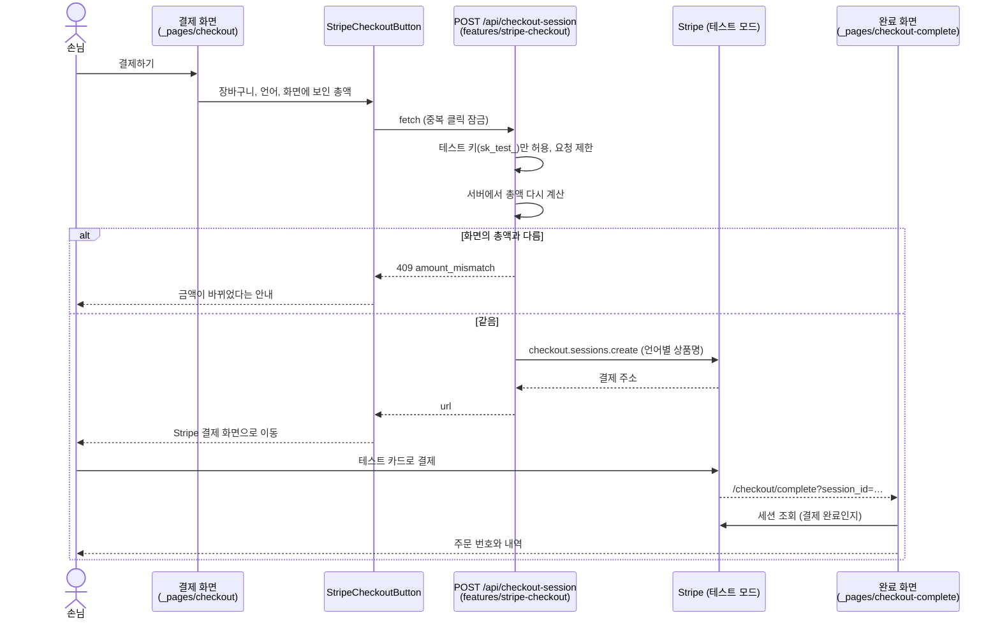
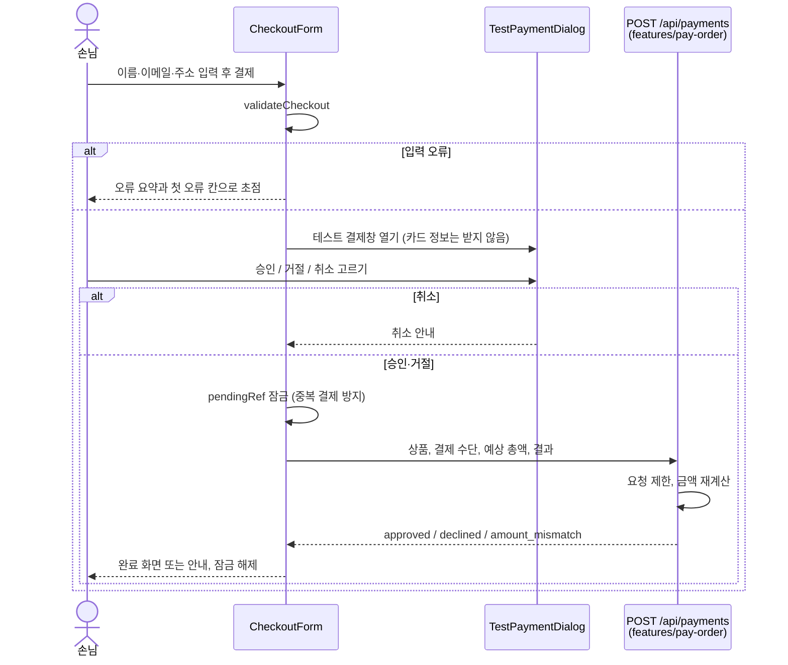
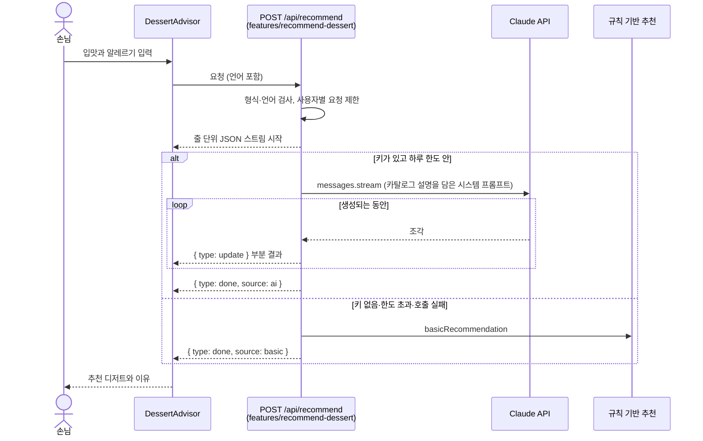

# 시퀀스 다이어그램

디저트 랜드의 주요 흐름입니다. 결제는 모두 테스트 결제이며, Stripe 테스트 키가 있으면 Stripe Checkout을, 없으면 내장 테스트 결제창을 씁니다.

## 1. Stripe Checkout 테스트 결제

```mermaid
sequenceDiagram
    actor 손님
    participant 화면 as 결제 화면<br/>(_pages/checkout)
    participant 버튼 as StripeCheckoutButton
    participant API as POST /api/checkout-session<br/>(features/stripe-checkout)
    participant 스트라이프 as Stripe (테스트 모드)
    participant 완료 as 완료 화면<br/>(_pages/checkout-complete)

    손님->>화면: 결제하기
    화면->>버튼: 장바구니, 언어, 화면에 보인 총액
    버튼->>API: fetch (중복 클릭 잠금)
    API->>API: 테스트 키(sk_test_)만 허용, 요청 제한
    API->>API: 서버에서 총액 다시 계산
    alt 화면의 총액과 다름
        API-->>버튼: 409 amount_mismatch
        버튼-->>손님: 금액이 바뀌었다는 안내
    else 같음
        API->>스트라이프: checkout.sessions.create (언어별 상품명)
        스트라이프-->>API: 결제 주소
        API-->>버튼: url
        버튼-->>손님: Stripe 결제 화면으로 이동
        손님->>스트라이프: 테스트 카드로 결제
        스트라이프-->>완료: /checkout/complete?session_id=…
        완료->>스트라이프: 세션 조회 (결제 완료인지)
        완료-->>손님: 주문 번호와 내역
    end
```

## 2. 내장 테스트 결제 (Stripe 키가 없을 때)

```mermaid
sequenceDiagram
    actor 손님
    participant 폼 as CheckoutForm
    participant 창 as TestPaymentDialog
    participant API as POST /api/payments<br/>(features/pay-order)

    손님->>폼: 이름·이메일·주소 입력 후 결제
    폼->>폼: validateCheckout
    alt 입력 오류
        폼-->>손님: 오류 요약과 첫 오류 칸으로 초점
    else
        폼->>창: 테스트 결제창 열기 (카드 정보는 받지 않음)
        손님->>창: 승인 / 거절 / 취소 고르기
        alt 취소
            창-->>폼: 취소 안내
        else 승인·거절
            폼->>폼: pendingRef 잠금 (중복 결제 방지)
            폼->>API: 상품, 결제 수단, 예상 총액, 결과
            API->>API: 요청 제한, 금액 재계산
            API-->>폼: approved / declined / amount_mismatch
            폼-->>손님: 완료 화면 또는 안내, 잠금 해제
        end
    end
```

## 3. AI 디저트 추천 (스트리밍)

```mermaid
sequenceDiagram
    actor 손님
    participant 화면 as DessertAdvisor
    participant API as POST /api/recommend<br/>(features/recommend-dessert)
    participant 클로드 as Claude API
    participant 기본 as 규칙 기반 추천

    손님->>화면: 입맛과 알레르기 입력
    화면->>API: 요청 (언어 포함)
    API->>API: 형식·언어 검사, 사용자별 요청 제한
    API-->>화면: 줄 단위 JSON 스트림 시작
    alt 키가 있고 하루 한도 안
        API->>클로드: messages.stream (카탈로그 설명을 담은 시스템 프롬프트)
        loop 생성되는 동안
            클로드-->>API: 조각
            API-->>화면: { type: update } 부분 결과
        end
        API-->>화면: { type: done, source: ai }
    else 키 없음·한도 초과·호출 실패
        API->>기본: basicRecommendation
        API-->>화면: { type: done, source: basic }
    end
    화면-->>손님: 추천 디저트와 이유
```
